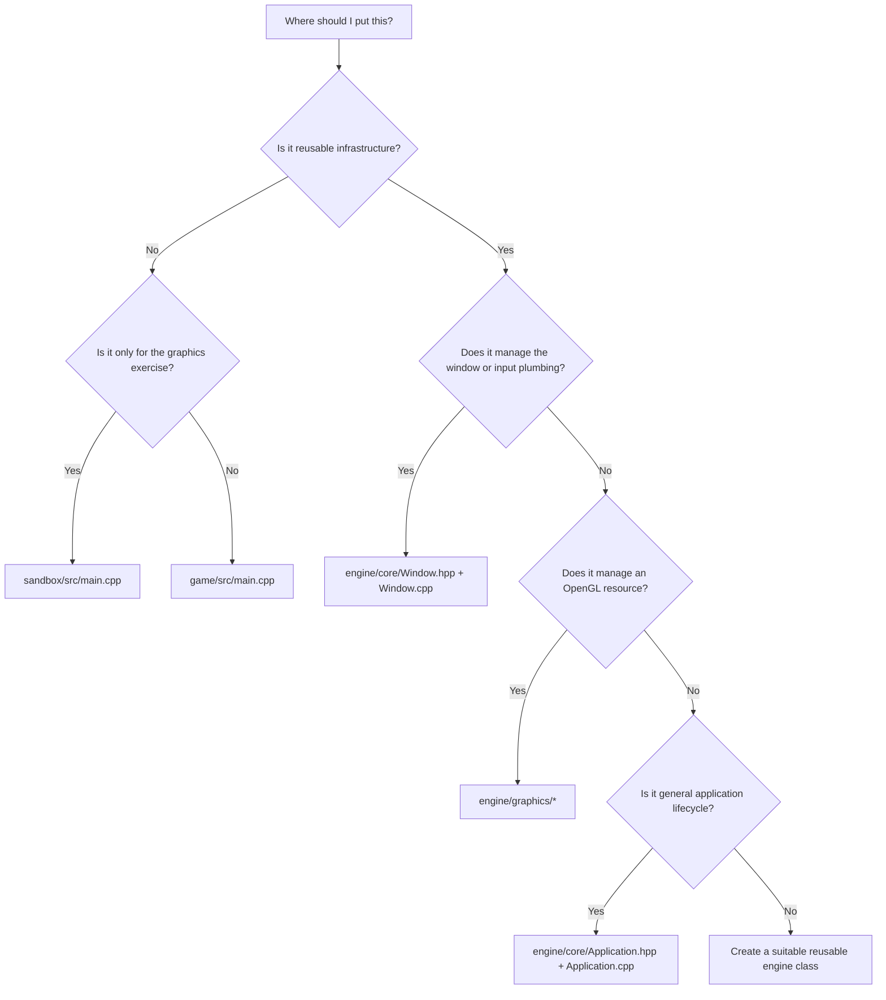

# Where Does This Belong?

Use this rule: reusable infrastructure goes in `engine`; exercise-specific behavior goes in `sandbox`; game behavior goes in `game`.



## Triangle exercise

| Task | Location |
|---|---|
| GLFW initialization and window creation | `engine/src/core/Window.cpp` |
| OpenGL context hints | `Window.cpp` |
| GLAD loading | `Window.cpp`, after the context becomes current |
| Keyboard callback plumbing | `Window.cpp` |
| Meaning of a key press, such as changing rotation direction | `sandbox/src/main.cpp` |
| Triangle vertices and colors | `sandbox/src/main.cpp` |
| VAO/VBO creation | `engine/graphics/VertexArray` and `Buffer` |
| Shader source files | `assets/shaders/` |
| Shader compilation and uniforms | `engine/graphics/Shader` |
| Rotation angle and model matrix | `sandbox/src/main.cpp`, using GLM |
| Camera view/projection matrix | `engine/graphics/Camera` |
| `glDrawArrays` or `glDrawElements` | Initially `sandbox/src/main.cpp`; later a renderer class |
| Tests | `tests/src/` |

## Mental model

```text
Window = creates the stage
GLAD   = provides OpenGL functions
Engine graphics = manages reusable GPU objects
Sandbox = performs the triangle exercise
Game   = contains actual game behavior
Assets = stores shaders, textures, and models
```
