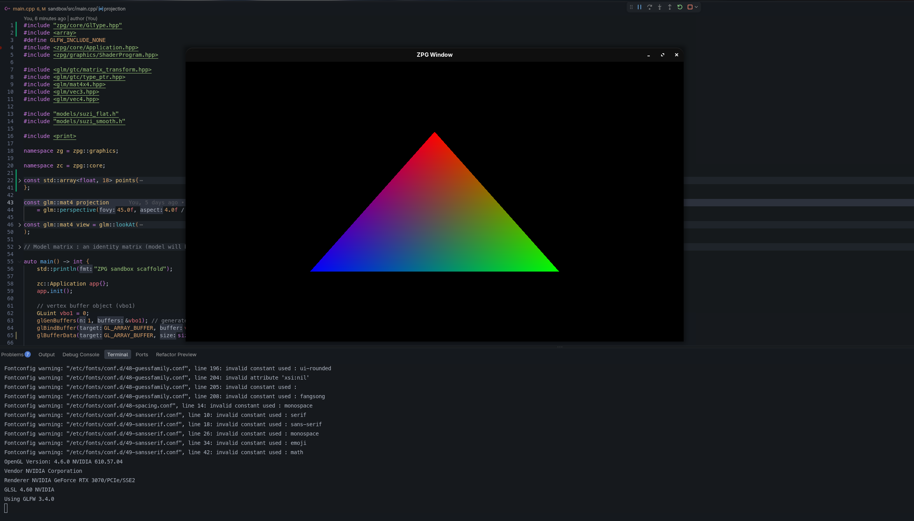
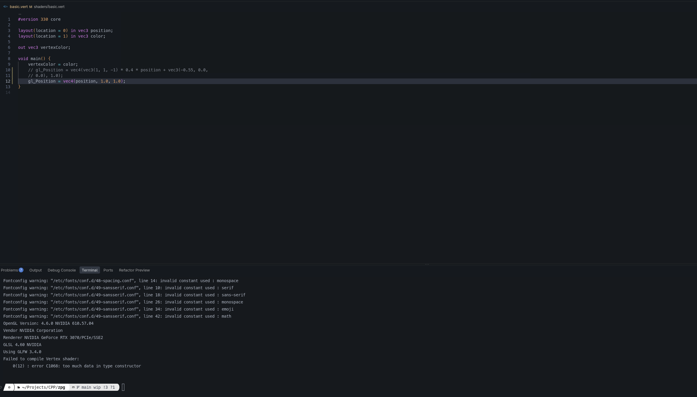
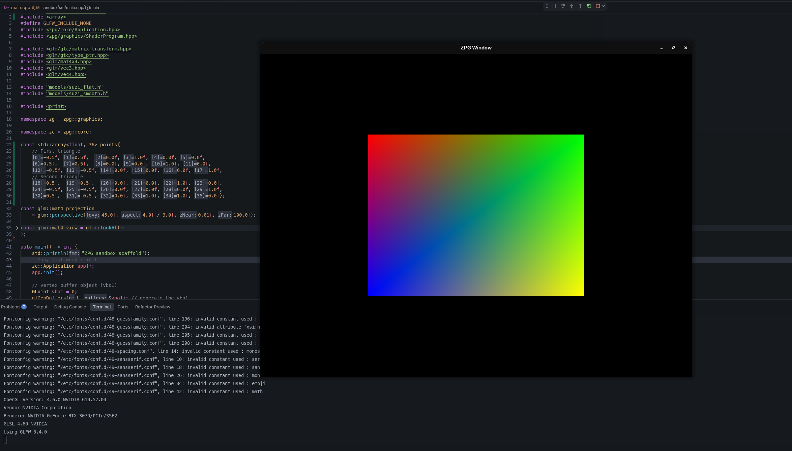
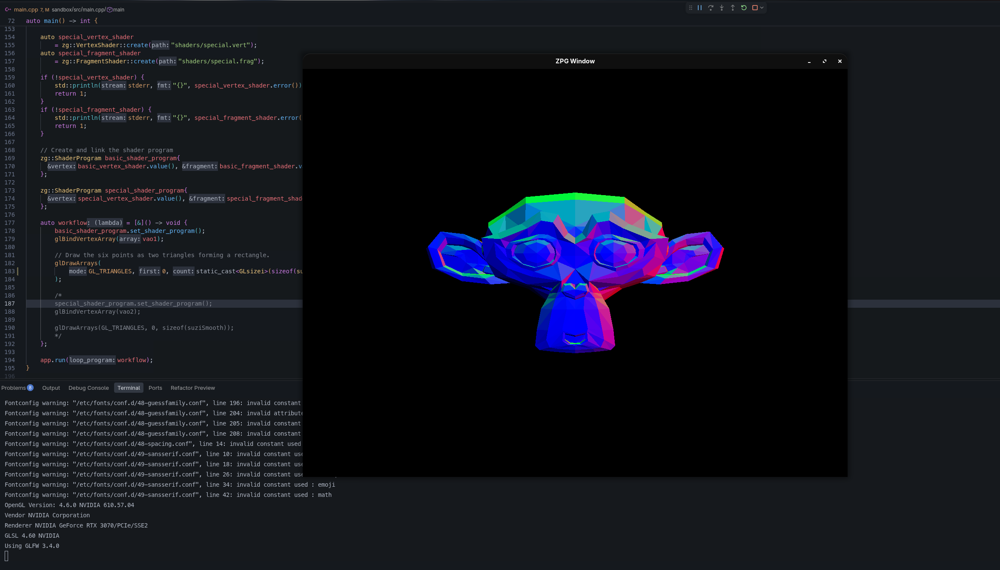
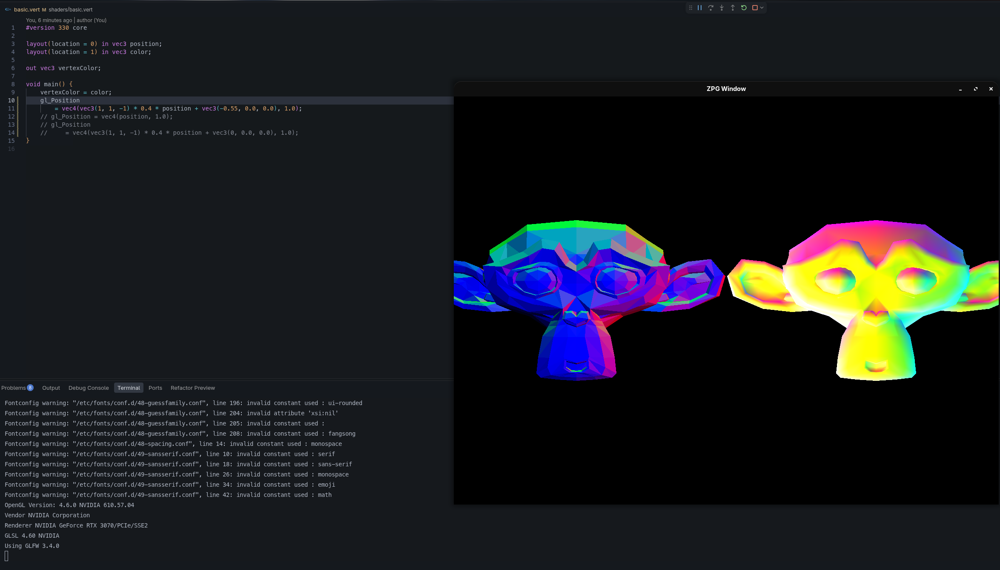

# Cvičení 2

---

1. Splněno - GLAD přidán, VBO a VAO, jednoduchý vertex Shader

2. Splněno

3. Splněno - čtverec vytvořen dvojicí trojúhelníků

4. Splněno - vykreslená opička s upraveným vertex shaderem pro otočení

5. Splněno - vykreslené dvě opičky s dvojicí vertex shaderů a inverzním fragment shaderem

6. Splněno
