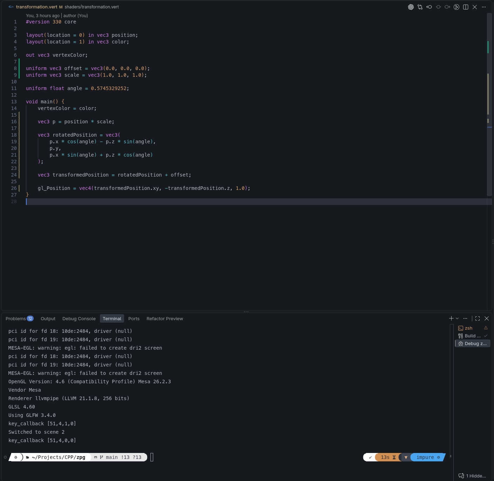
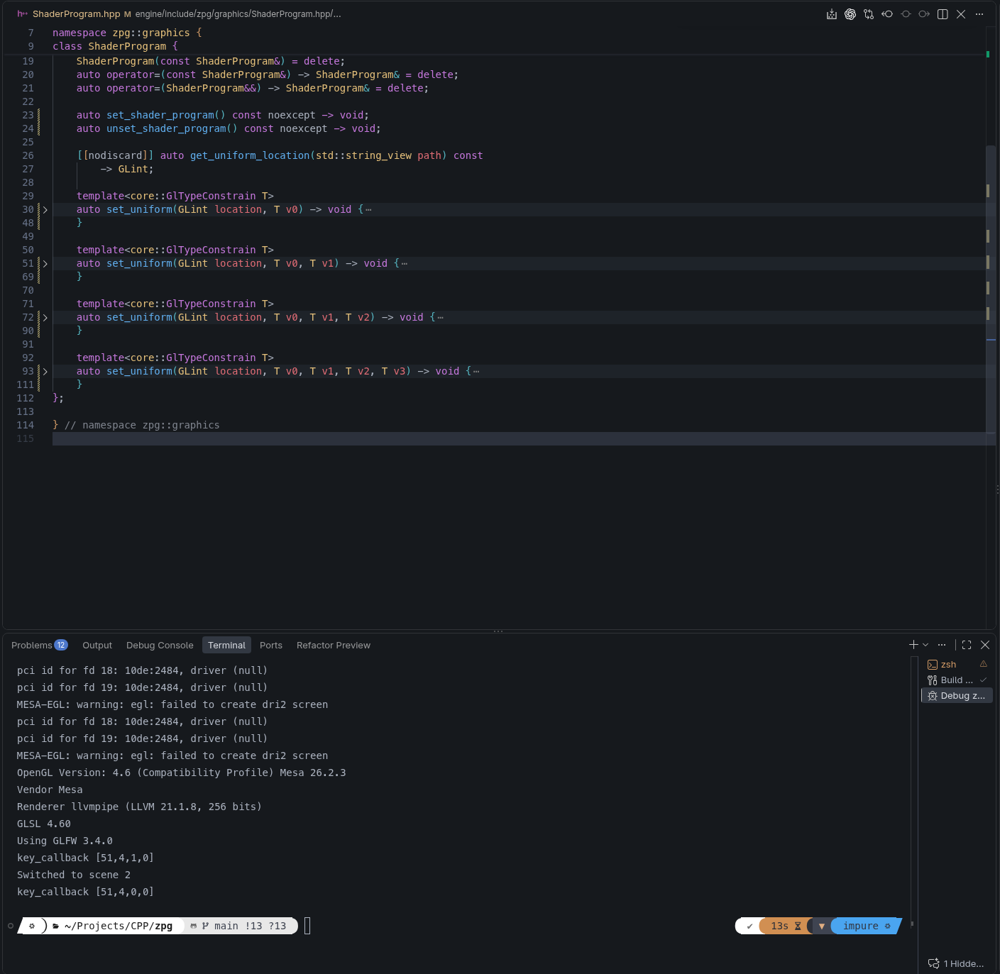
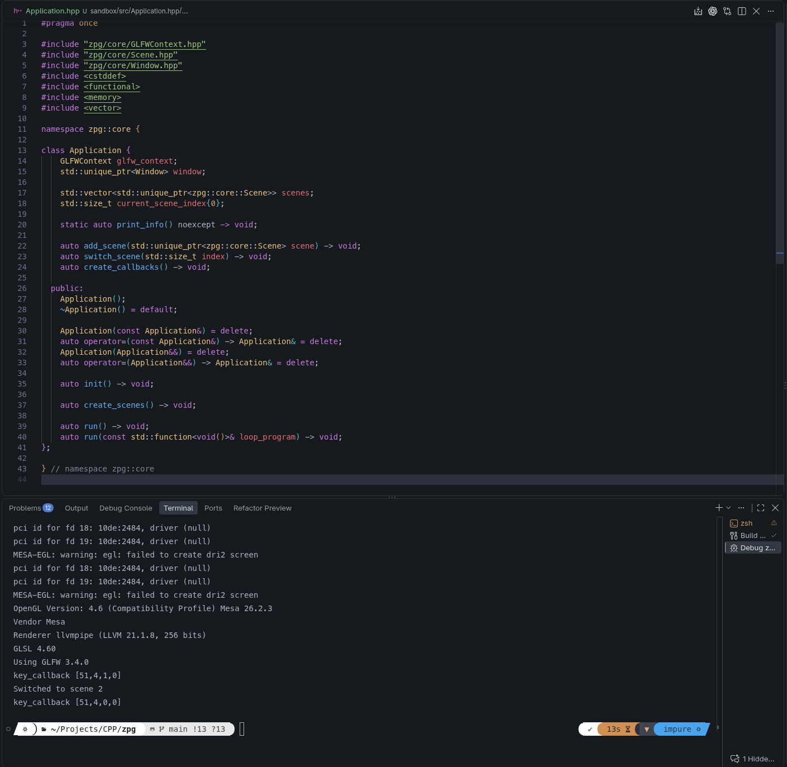
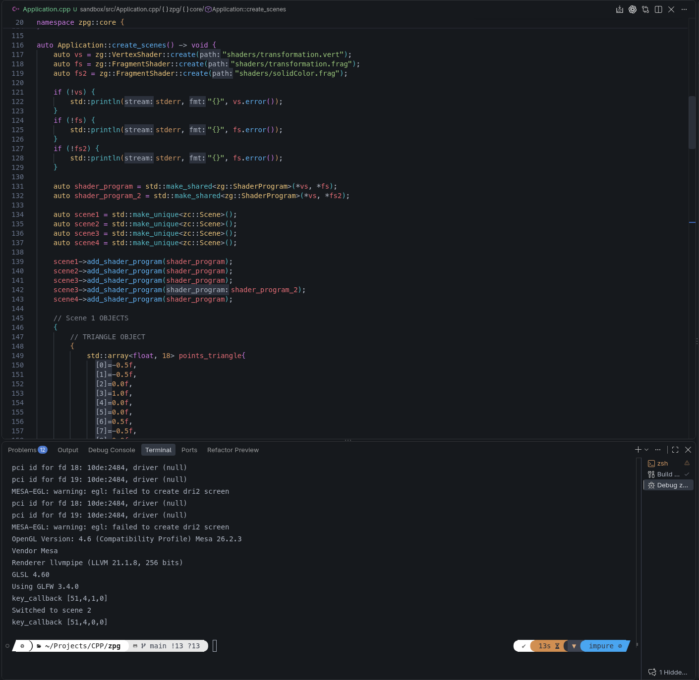
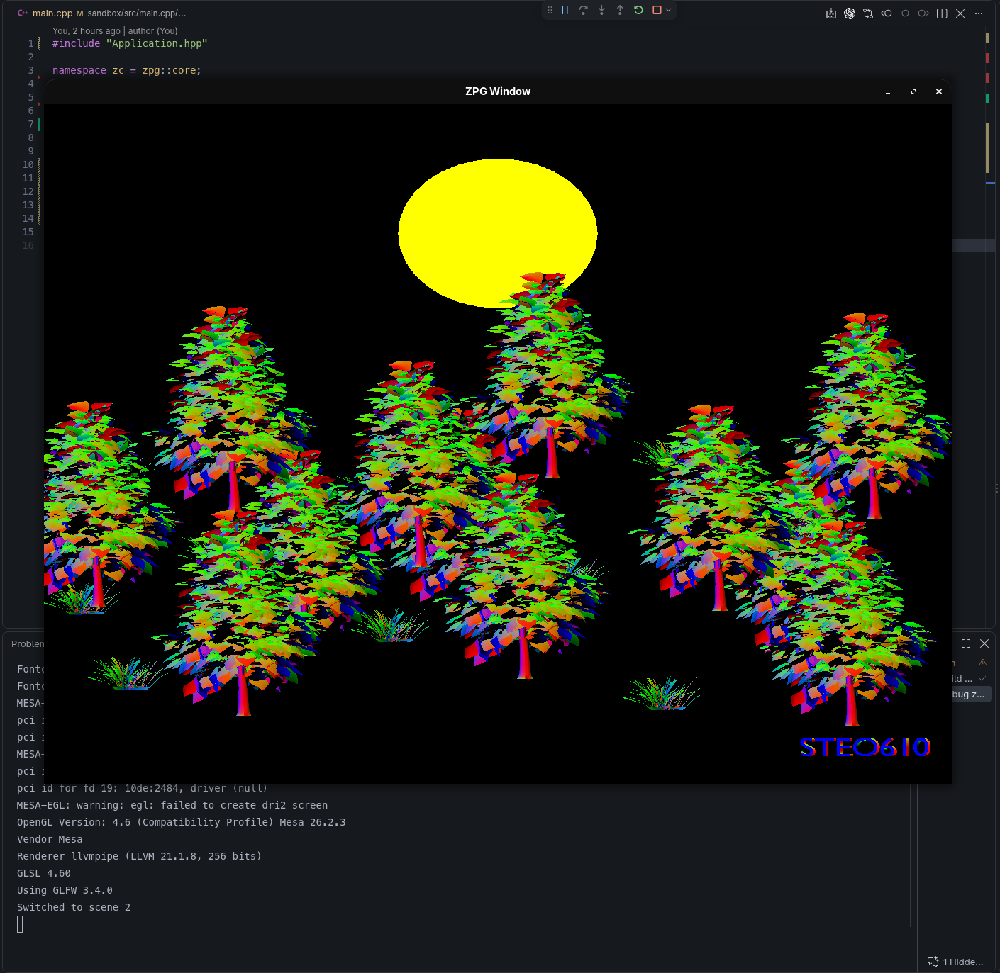
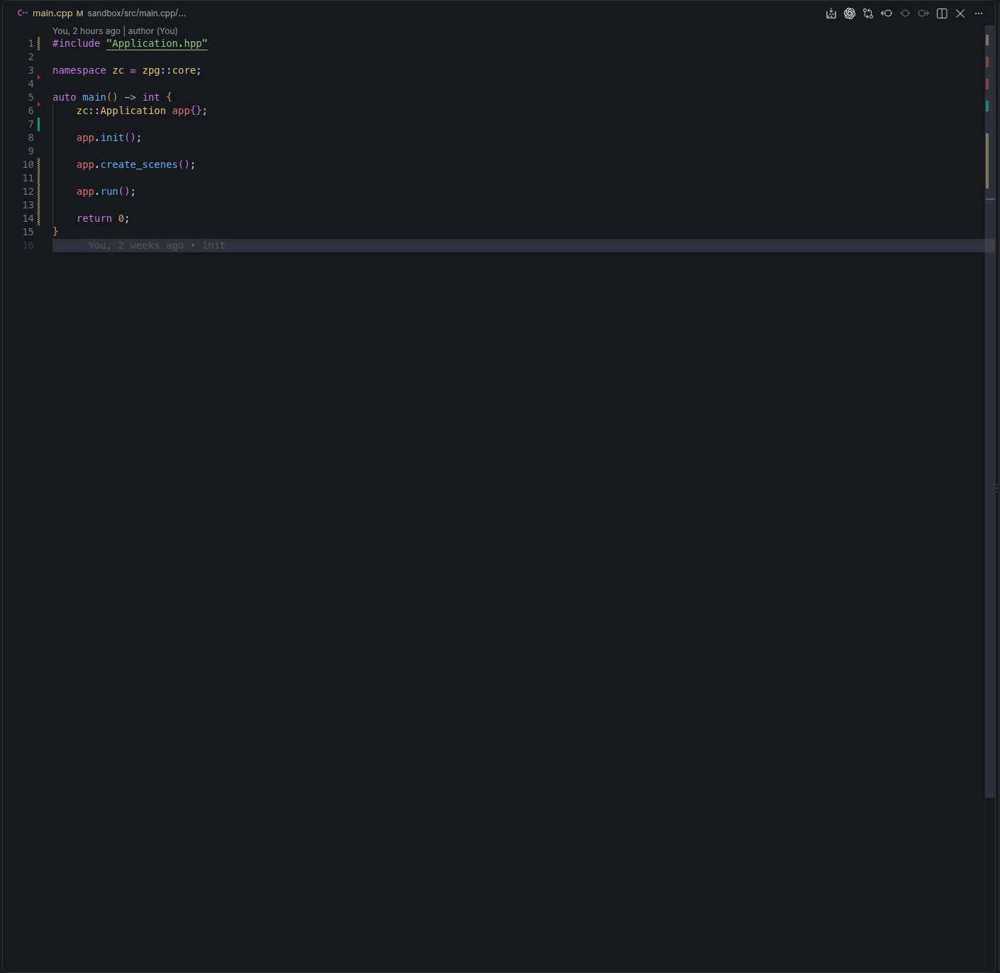
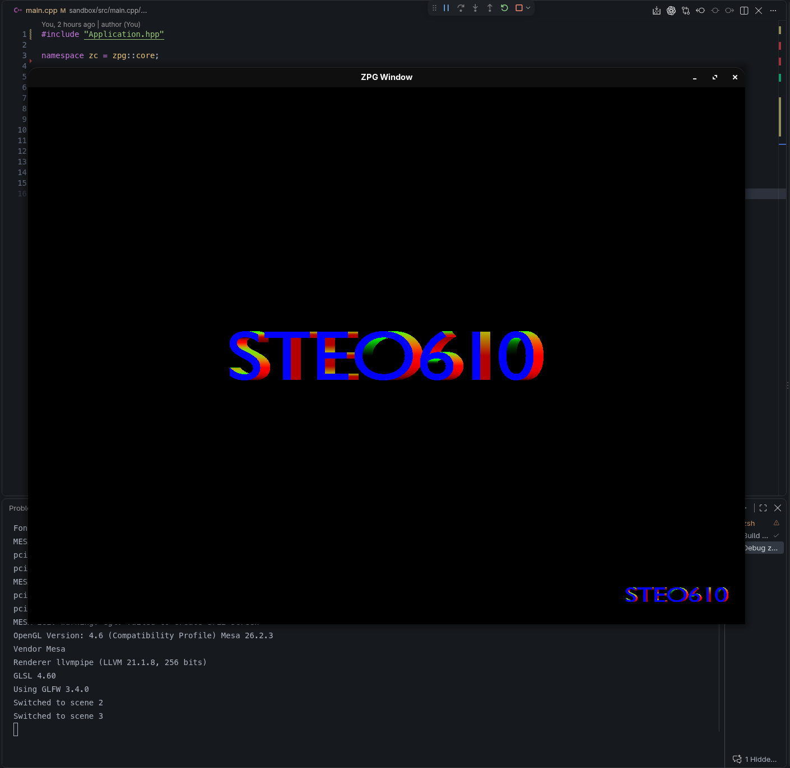
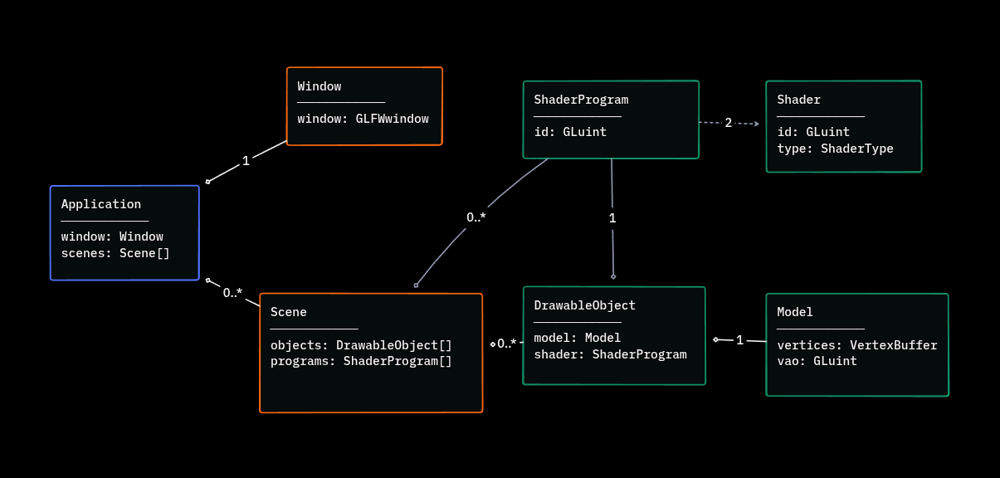

# Cvičení 3

---

1. Splněno - Využití základních funkcí, příště implementace třídy Transformation

2. Splněno - Kombinace templates a overloadingu

3. Splněno

4. Splněno - Splněno, využit observer

5. Splněno - Slunce umístěno do pozadí podle osy Z

6. Splněno

7. Splněno

8. Splněno

